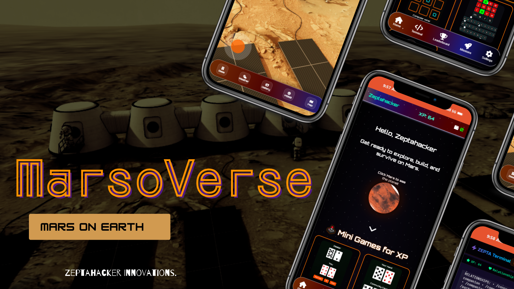
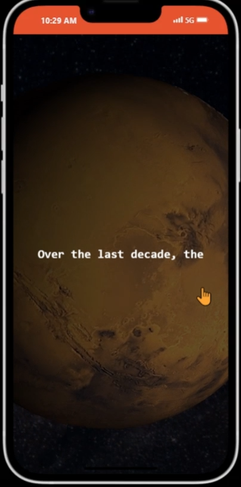
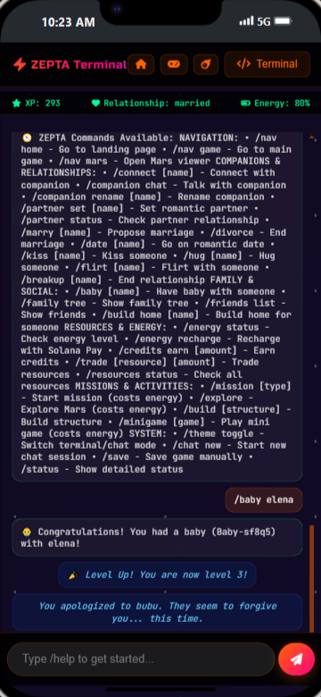
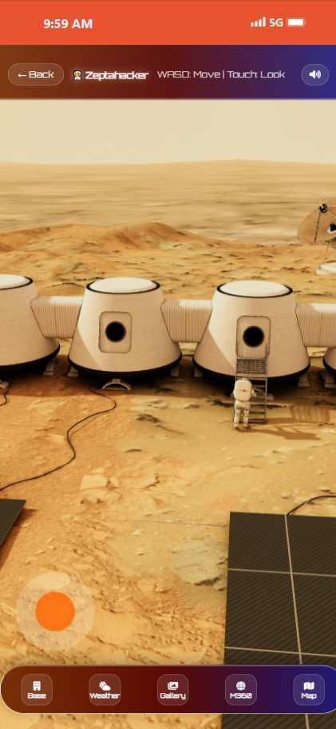
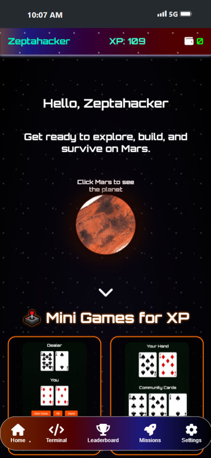
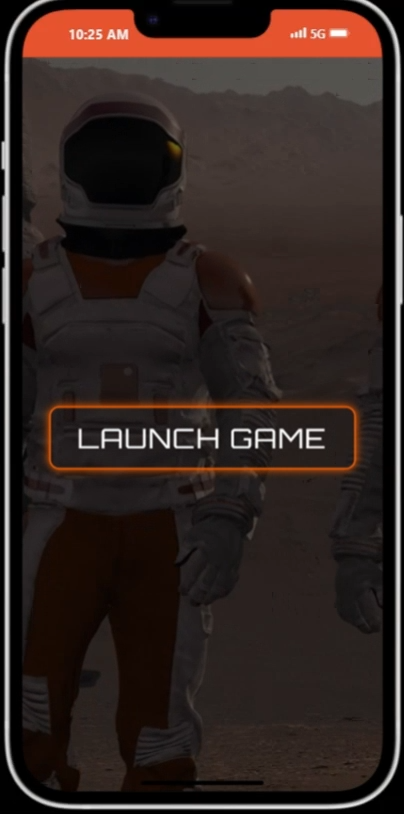

# Marsoverse: A Gamified Metaverse Exploration on Mars

  

## Introduction

Marsoverse is an immersive, browser-based 3D game universe that transports players to a colonized Mars. Built with Vanilla JavaScript, Three.js for 3D rendering, Solana for Web3 integration, and the Honeycomb protocol for decentralized player data, it combines storytelling, coding challenges, mini-games, and exploration in a futuristic Martian landscape.

Escape Earth's destruction and build a new life on the Red Planet! Whether you're coding in the Zepta Terminal, exploring 3D Mars maps, or earning XP through missions, Marsoverse blends education, strategy, and fun in a low-resource, accessible metaverse.

**Live Demo**: [https://marsoverse.netlify.app](https://marsoverse.netlify.app)  
**GitHub Repo**: [https://github.com/JaimeCabary](https://github.com/JaimeCabary)

  
*Placeholder: Screenshot of the landing page with cosmic visuals, onboarding form for name/age, wallet connect button, and intro story animation.*

## Story Background

In Marsoverse, Earth's core has disintegrated, causing the planet to explode. Forward-thinking scientists channeled the explosive energy to warm Mars' cold surface, making it habitable for humanity's survivors. Now, as a Martian pioneer, your goal is to explore, survive, and thrive on this new world.

The game starts with narrative onboarding: Enter your name and age, connect your Solana wallet, and dive into the lore. You'll play Mars-themed mini-games, code in the Zepta Terminal (with real consequences and responses), chat with a bot for guidance, and navigate a 3D Mars map for immersive exploration.

**Key Theme**: "Mars on Earth" - Bring the Red Planet to your browser for gamified learning and adventure.

  
*Placeholder: Screenshot of the story popup or animation showing Earth's explosion and Mars warming process.*

## Features

- **Immersive 3D Exploration**: Powered by Three.js, view a dynamic Mars terrain with orbit controls, asset loading (ships, bases), dynamic lighting, shaders, and reflections. Includes a 360-degree viewer (note: Some 360 videos are in MVP stage and may need fixes).
- **Zepta Terminal**: A UNIX-like command-line interface for coding and control. Type commands like `/help`, `/date`, `/status` to manage resources, missions, and interact with the game world. Code directly or use the chatbot - every action has consequences!
- **Mini-Games and Missions**: Play Mars-themed games to earn XP and SOL (Solana tokens). Daily login rewards in the missions section. Track progress with local storage (XP and fake USDT for MVP; planning on-chain upgrades).
- **Real-Time Mars Insights**: Pull weather data and images from NASA APIs for an authentic experience.
- **HUD Navigation**: Main page (`marzo.html`) with a bottom nav bar including Home, Leaderboard, Missions, Settings, and Terminal button. HUD updates energy, stats, and more in real-time.
- **Web3 Integration**: Connect your Solana wallet (deep linking for mobile in progress). Uses Honeycomb protocol for on-chain storage of player decisions, mission tracking, XP, and rewards. (Currently partial in `server.js`; full functionality WIP.)
- **Admin Panel**: Secure access for admins (prompts for password on login if "admin" is selected) to track user data.
- **Chatbot and Feedback**: Interactive bot for guidance, with JSON-based state management.

**Note**: Leaderboard is currently non-functional (tracking via local storage; considering replacement with another feature like collectibles).

  
*Placeholder: Screenshot of the terminal interface with command examples and system responses.*

  
*Placeholder: Screenshot of the 3D Mars map with terrain, controls, and assets.*

  
*Placeholder: Screenshot of the HUD with nav bar: Home, Leaderboard, Missions, Settings, Terminal.*

## How to Play (User Journey)

1. **Landing & Onboarding (`index.html`)**: Visit the site, enter your name and age, connect your wallet, and read the Earth's destruction story. Generate your avatar and user ID with a WebGL-powered intro animation.
2. **Accept a Mission (`marzo.html`)**: Navigate via HUD to view missions. Accept one to start your Martian adventure.
3. **Launch via Zepta Terminal (`zeep.html`)**: Use commands to control systems, code solutions, or chat with the bot. Earn XP for successful actions.
4. **Explore Mars (`mars-viewer/dist/index.html`)**: Load the 3D viewer to orbit the planet, view weather/images from NASA, and interact with the terrain.
5. **Play Mini-Games**: Access via missions or HUD to gain rewards (XP, fake USDT in MVP).
6. **Daily Login & Progress**: Log in daily for bonuses. Save progress locally (with Honeycomb on-chain tracking in development).
7. **Admin Access (if applicable)**: Enter "admin" on login for password prompt and backend tracking.

Seamless navigation across pages with cosmic visuals and futuristic interfaces.

  
*Placeholder: Create or add a simple flowchart image showing the steps above.*

## Tech Stack

- **Core Rendering**: Three.js for 3D graphics and WebGL.
- **Languages & Logic**: Vanilla JavaScript/ES6 for game logic and UI (no React).
- **UI/UX**: HTML/CSS for interfaces, including HUD and terminal.
- **Web3 & Decentralization**: Solana for wallet connect, Honeycomb protocol for on-chain data (integrated in `server.js` via NPM).
- **Data Management**: Local storage for XP/USDT tracking (MVP); JSON for state.
- **APIs**: NASA for real-time Mars weather and images.
- **Other**: Pygame/Chess libs not used; focus on browser-native tools. No additional installs needed (all via NPM where applicable).

Built as an MVP with 12 days left for fixes, including leaderboard, 360 video loading, full wallet deep linking, and Honeycomb verification.

## Installation & Setup

No installation required! Marsoverse is fully browser-based.

1. Visit the demo URL: [https://marsrovers.netlify.app](https://marsoverse.netlify.app).
2. For development:
   - Clone the GitHub repo: `git clone https://github.com/JaimeCabary.git`
   - Run `npm install` for dependencies (e.g., Honeycomb).
   - Start a local server (e.g., via Live Server extension or `node server.js`).
3. `server.js` handles backend logic (Honeycomb API calls).

Contributions welcome - fork the repo and submit PRs!

## Future Possibilities

- Multiplayer exploration and Martian economy with collectibles.
- AI-generated missions and expanded planetary systems.
- DAO-style governance for players.
- Fix MVP issues: Working leaderboard, 360 videos, full wallet integration, on-chain XP tracking.
- Mobile deep linking for better phone experience.

## Meet the Team

- **Shalom Ebere Chidi-Azuwike**: Lead Developer (built with AI assistance from ChatGPT, Grok, DeepSeek, Claude).
- **AI Collaborators**: ChatGPT, Grok, DeepSeek, Claude for ideation and code support.

Follow for updates: [GitHub](https://github.com/JaimeCabary)

## Feedback & Questions

Ready to become a Martian? Dive in and explore! For feedback, contributions, or questions, open an issue on GitHub or reach out. Let's build the future of Mars together.

Thank you! Built with AI and Love by Shalom Chidi-Azuwike.

